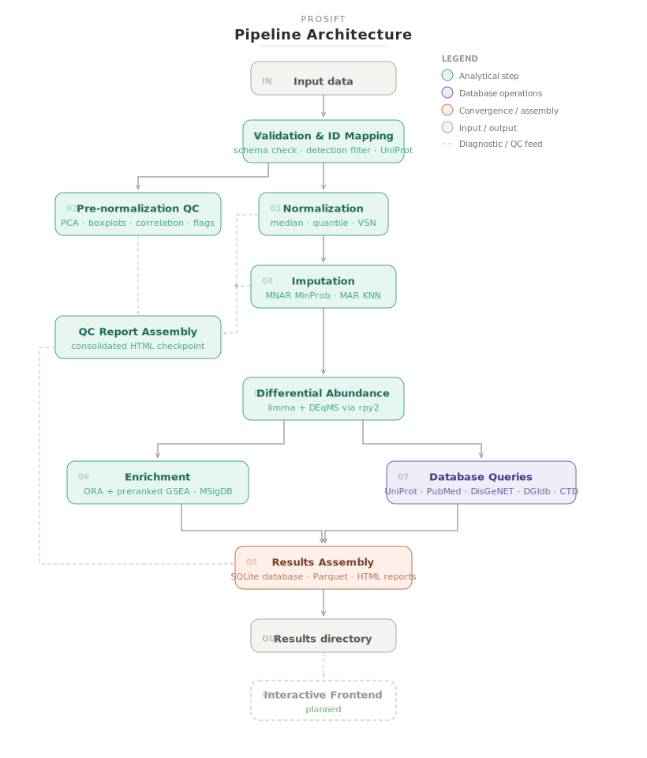
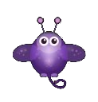

### Hi, I'm Rei

M.S. in Bioinformatics and Medical Informatics (May 2026), actively looking for roles in biotech where I can apply computational and molecular biology skills to problems in genomics, proteomics, drug discovery, or translational research. Currently wrapping up thesis research in the [Blanco-Suárez Lab](https://www.blancosuarezlab.com/) on astrocyte proteomics and CNS repair.

I build -omics pipelines in Nextflow and Snakemake, but the part I care about most is getting the methodology right for the data at hand. That's meant designing separate analytical tracks for data that behave differently under missingness, building application-level caching so incremental study expansions don't burn through API budgets, and designing imputation strategies that distinguish biological absence from technical dropout. My projects have taken that approach across proteomics, population genomics, and transcriptomics.

---

#### What's here

**[ProSIFT](https://github.com/ReitheHeroine/ProSIFT)** — A generalized discovery proteomics pipeline, and my most ambitious project.
Nextflow DSL2 end-to-end workflow: input validation, UniProt ID mapping, normalization, missingness-aware imputation (MNAR/MAR-stratified MinProb + KNN), differential abundance (limma + DEqMS via rpy2), and functional enrichment (ORA and preranked GSEA via gseapy against MSigDB). Queries five external databases in parallel (UniProt, PubMed, DisGeNET, DGIdb, CTD) to build integrated per-protein annotation profiles. Outputs structured Parquet tables, interactive HTML reports, and diagnostic plots. Manuscript in preparation.

  

**[Ketamine_Astrocyte_Proteomics](https://github.com/ReitheHeroine/Ketamine_Astrocyte_Proteomics)** — Snakemake pipeline for my MS thesis, analyzing how ketamine reshapes the cortical astrocyte proteome.
Mouse TMT-labeled DDA LC-MS/MS data. Welch's t-test differential abundance with a separate analytical track for presence/absence proteins (avoiding Proteome Discoverer placeholder ratio artifacts), g:Profiler GO/KEGG enrichment with a custom detected-proteome background, REVIGO redundancy reduction, and a three-tier validation framework designed around the realities of n=3 biological replicates. All thresholds and paths externalized to config.yaml.

**[Coccinella_Invasion_Genomics](https://github.com/ReitheHeroine/Coccinella_Invasion_Genomics)** — Population genomics pipeline asking which regions of the ladybug genome show signatures of selection during invasion.
Parallel selection scans (percentile FST via vcftools + PCA-based outlier detection via pcadapt) with OutFLANK concordance validation. Maps candidate SNPs to genes via a local multi-species BLAST ortholog chain (Csep → *Harmonia* → *Tribolium*) and tests for GO-term overrepresentation using clusterProfiler with pattern-stratified foreground sets. Includes an independent MaxEnt environmental niche model for current and projected habitat suitability.

**[Protein_Structure_Classification](https://github.com/ReitheHeroine/Protein_Structure_Classification_Final_Project)** — Multi-label classification of protein functional categories from PDB biophysical features.
A custom keyword-matching engine parses free-text PDB classification strings (handling binding disambiguation and DNA/RNA priority logic) into a 23-class binary target matrix. Three classifiers compared: Random Forest, Decision Tree (scikit-learn), and Neural Network (TensorFlow/Keras).

I also make things for fun! **[Glim](https://github.com/ReitheHeroine/Glim)**   — A browser-based wellness companion PWA with an interactive creature, habit tracking, and cross-device sync. A pet project (literally) for learning frontend development.

---

#### Tools and technologies

**Languages:** `Python` · `R` · `SQL` · `Bash`

**Pipeline/workflow:** `Nextflow (DSL2)` · `Snakemake`

**Proteomics:** `limma` · `DEqMS` · `g:Profiler` · `gseapy` · `rrvgo` · `REVIGO` · `Proteome Discoverer` · `MaxQuant`

**Genomics:** `vcftools` · `PLINK` · `BLAST+` · `bcftools` · `pcadapt` · `OutFLANK` · `GATK` · `samtools` · `BWA` · `DRAGEN (limited)`

**Enrichment and annotation:** `clusterProfiler` · `enrichR` · `UniProt REST` · `NCBI E-utilities` · `DisGeNET` · `DGIdb` · `CTD` · `STRING` · `Cytoscape` · `GO` · `KEGG` · `MSigDB`

**ML:** `scikit-learn (RandomForest, KNN, IterativeImputer)` · `TensorFlow/Keras`

**Visualization:** `plotly` · `matplotlib` · `seaborn` · `ggplot2` · `kaleido` · `Tableau`

**Data and infrastructure:** `pandas` · `numpy` · `scipy` · `pyarrow/Parquet` · `Git` · `conda` · HPC clusters (PBS/Torque, Jetstream2) · limited AWS experience (Redshift, Athena, Glue)

---

#### Get in touch

I'm actively seeking bioinformatics and data-focused roles in biotech. Feel free to reach out via [LinkedIn](https://www.linkedin.com/in/reina-hastings/) or email me at reinahastings13@gmail.com.
